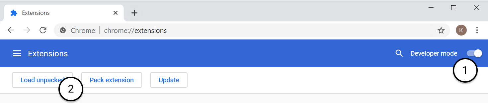

# Twitch-DVR player

`twitch-dvr` is a Chrome / Edge / Firefox extension that replaces the built-in Twitch player with a custom player that supports DVR: that is, you can seek to any point in the current broadcast and jump back to live at any time. Note that `twitch-dvr` does not replace the VOD player, nor the frontpage player. The user can switch between the DVR player and the default Twitch player at any time.

`twitch-dvr` is written in vanilla Javascript 😱.

## Installation (for development)

To install `twitch-dvr` for development, simply go to `chrome://extensions` (or `edge://extensions` on Edge, or `about:debugging` on Firefox), enable Developer Mode if you haven't already, and then choose "Load Unpacked" and navigate to and select `manifest.json` from this repo.

## Notable differences from default Twitch player

1. `twitch-dvr` does not do *any form* of adaptive bitrate switching. It is the author's opinion that adaptive bitrate is a bad user experience, unless you have tons of variants like Netflix, and even sometimes then. It is understandable that Twitch switches variants when the tab loses focus to save on bandwidth, but this extension does not implement that feature either (that Twitch "feature" is also somewhat buggy, a lot of the times the player will forget your preferred quality).
2. Closed captioning is not supported. This would be nice to support at some point but so few streams have closed captions anyway that it's hard to find a stream to test this on.
3. Extensions are not supported. This is the biggest omission in the author's opinion but supporting this would be fairly difficult. It'd be great to get this to work in the future but I'm honestly not sure how realistic it is.
4. The latency of the DVR player is currently slightly worse than the default player on low-latency mode. This should be fairly easy to correct. As a side note from my testing, Twitch's latency optimizations on the server end are pretty impressive.
5. Playback speed is not supported. The author does not personally have a use case for this but it shouldn't be hard to implement this.

## MP4 Muxing

This extension was initially written to use Twitch's .ts segments directly with Media Source Extensions, however only Edge on Windows supports this. As a result, we now use [mux.js](https://github.com/videojs/mux.js/) to transmux .ts video to `mp4`. It would be nice to support pure `mp2t` mode for Edge, but unfortunately the fact that `mp4` has timestamps that always start at 0 vs `ts` having timestamps of actual stream time means that supporting both is a bit clunky.